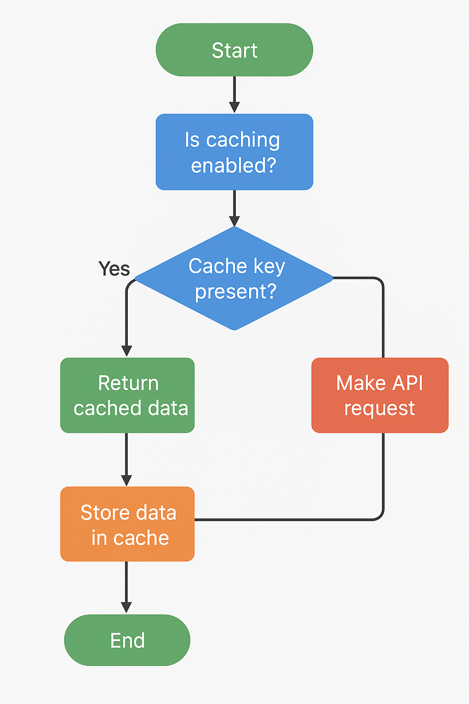

# Star Wars Backend API - Technical Documentation

## Overview

This backend service interacts with the [SWAPI.tech API](https://www.swapi.tech) to fetch Star Wars data, including characters, resources, and search functionality. It implements caching using `node-cache` to improve performance and reduce redundant API requests.

---

## Architecture

- **Node.js** backend
- **Axios** for HTTP requests
- **Node-cache** for in-memory caching
- **Project Structure:**

star-wars-backend/
├─ src/
│ ├─ config/
│ │ └─ index.js
│ ├─ controllers/
│ │ └─ characterController.js
│ ├─ middleware/
│ │ ├─ errorHandler.js
│ │ └─ requestLogger.js
│ ├─ routes/
│ │ └─ characters.js
│ ├─ services/
│ │ └─ swapiService.js
│ ├─ utils/
│ │ ├─ cache.js
│ │ └─ errors.js
│ └─ app.js
├─ .gitignore
├─ package-lock.json
├─ package.json
├─ readme.md
├─ server.js
└─ test-cache.js

## Modules

### **1. cache.js**

- Single NodeCache instance for caching API responses.
- Configuration:
  - `stdTTL`: 600 seconds (10 minutes)
  - `checkperiod`: 120 seconds
  - `useClones`: false
- Functions:
  - `get(key)` – Retrieve cached value or null
  - `set(key, value, ttl)` – Store value in cache
  - `del(keys)` – Delete specific cache entries
  - `flush()` – Clear all cache
  - `connectToCache()` – Initialize cache and log

### **2. swapiService.js**

- Class `SwapiService` handles all API requests with optional caching.
- **Axios instance** with:
  - Base URL: `https://www.swapi.tech/api`
  - Timeout: 10s
  - Request & response interceptors for logging and error handling

#### **Methods**

| Method                              | Description                           |
| ----------------------------------- | ------------------------------------- |
| `request(url, cacheKey, ttl = 600)` | Generic API request with caching      |
| `getCharacters(page, limit)`        | Fetch paginated characters            |
| `getAllCharacters()`                | Fetch all characters                  |
| `searchCharacters(name)`            | Search characters by name             |
| `getCharacterById(id)`              | Fetch single character by ID          |
| `getResource(url)`                  | Fetch a single resource by URL        |
| `getResources(urls)`                | Fetch multiple resources concurrently |
| `enableCache()`                     | Enable caching globally               |
| `disableCache()`                    | Disable caching globally              |

---

## Caching Strategy

- **Purpose:** Reduce API calls, improve performance
- **Cache keys:** Unique per API request
- **TTL:** Default 10 minutes, customizable per request
- **Invalidation:** Use `flush()` or `del()` for manual clearing

---

## Logging

- Requests and cache hits logged to console
- Errors logged with details

---

## Testing Cache

- Use `test-cache.js` to simulate:
  - API requests
  - Cache hits and misses
  - Cache flushing
  - Disabling cache

---

## Dependencies

- Node.js >= 18
- `axios`
- `node-cache`

---

## Table of Contents

- [Features](#features)
- [Flow](#flow)
- [Installation](#installation)
- [Usage](#usage)
- [API Endpoints](#api-endpoints)
- [Caching](#caching)
- [Technologies](#technologies)
- [License](#license)

---

## Features

- Fetch data from SWAPI endpoints such as characters, planets, starships, etc.
- In-memory caching to minimize repeated API requests.
- Simple cache TTL (time-to-live) support.
- Easy-to-use API interface for frontend or other services.
- Error handling and logging.

---

## Flow

The backend follows this caching flow:

1. **Client Request**  
   Any method such as `getCharacterById`, `getCharacters`, or `searchCharacters`.

2. **Check Cache**  
   Lookup the cache using the generated `cacheKey`.

3. **Cache Hit?**

   - **Yes:** Return cached data.
   - **No:** Make an API request to SWAPI.

4. **API Call**  
   Axios request is made to the SWAPI endpoint.

5. **Store in Cache**  
   If the API call succeeds, store the response in cache with TTL.

6. **Return Data**  
   Return the data to the client.

### Flowchart



## Future Improvements

- Add persistent caching (Redis or database)
- Implement rate-limiting for API requests
- Add automated tests (Jest or Mocha)
- Add support for more SWAPI endpoints (planets, starships, etc.)

---

## Author

Akbar Shuvo

## Installation

```bash
git clone <your-repo-url>
cd star-wars-backend
npm install
```
